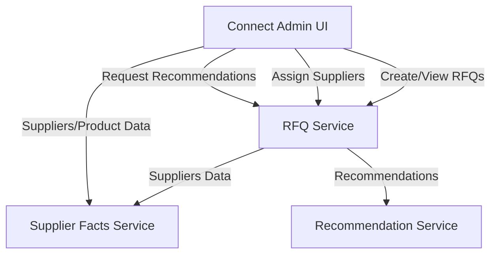

# RFQ Supplier Recommendation System (MVP)

This monorepo contains multiple services and a front-end UI for managing RFQs (Request for Quotations), supplier data,
and AI-based supplier recommendations.

## Architecture Overview



### Services

Services running locally (not in containers) on localhost on different ports.

1. Connect Admin (UI) (port 8089)
2. Supplier Facts Service (port 8080)
3. RFQ Service (port 8081)
4. Recommendation Service (port 8000)

## How to run PostgresSQL

To run postgres use the container:

```shell
docker-compose up
```

It will create required databases as well upon start: `supplier_facts` and `rfq_service`