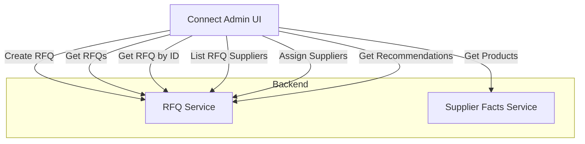

# Connect Admin

Connect Admin is an internal MVP UI built with Svelte to manage RFQ (Request for Quotation) creation and supplier
assignments.

It showcases:

- Manual RFQ creation
- Manual Supplier assignment
- Recommended suppliers (recommendation-service)

While the UI is minimal, it demonstrates the end-to-end flow and service integration.

## Key Features

1. RFQ Creation: Users can submit new RFQs including title, description, delivery location, and product type.
2. View Existing RFQs: Displays all created RFQs.
3. Manual Supplier Assignment: Users can assign up to 5 suppliers per RFQ using UUIDs of supplier.
4. Product Catalog: Paginated view of available products and supplier details.
5. Supplier Recommendations: Intelligent suggestions of suitable suppliers.

## Running locally

Setup:

```shell
npm install --save-dev @sveltejs/vite-plugin-svelte              
npm install
npm run dev
```

The app will be available at: http://localhost:8089

## Used APIs

**RFQ Service** (http://localhost:8081/rfq-service)

To create RFQ: `POST /internal_api/rfqs`
To list all RFQs: `GET /internal_api/rfqs`
To get RFQs details: `GET /internal_api/rfqs/:id`
To list RFQs assigned suppliers: `GET /internal_api/rfqs/:id/suppliers`
To assign new suppliers to RFQ: `POST /internal_api/rfqs/:id/suppliers`
To get all recommended suppliers: `GET /internal_api/rfqs/:id/suppliers/recommend`

**Supplier Facts Service** (http://localhost:8080/supplier-facts-service)

To get all available suppliers with their products: `GET /internal_api/products?page=0&size=10`

## Rules

RFQ Fields:

- All fields are required: title, description, delivery location, product type.

Supplier Assignment:

- Max 5 suppliers per RFQ
- Each supplier is added using UUID (must be a valid UUIDv4 format)
- Duplicated suppliers are not allowed

Recommendations:

- Suppliers are not auto-assigned; user must manually enter UUIDs (indeed, in the future when the quality of data is
  good for an algorithm, this should happen automatically)

## Architecture



NOTE: recommendations are taken not directly via recommendations-service, but through rfq-service.

## Limitations

1. No authentication or user roles
2. Minimal form validation (client-side only and backend takes whatever is sent)
3. Recommendations shown but not auto-applied

## Future Improvements

1. Add authentication (JWT)
2. Enhanced validation
3. Automatic assignment of suppliers based on recommendations
