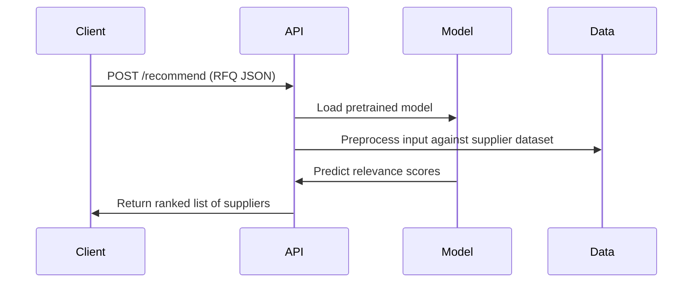

# Recommendation Service

A minimal recommendation system that uses machine learning to suggest the most relevant suppliers for an incoming RFQ (
Request for Quote). Built using Python, FastAPI, and scikit-learn for a quick and scalable MVP.

## Project Structure

```shell
.
├── api.py                  # FastAPI server exposing the recommendation endpoint
├── recommender.py          # CLI for training and generating recommendations
├── data/
│   ├── combined_dataset.csv
│   └── suppliers_data_unique.csv
├── city_cache.json         # Cached location data
├── requirements.txt        # Python dependencies
└── README.md               # You're here
```

## Features

- Trains a supplier recommendation model using RandomForestClassifier
- CLI and API interface to generate predictions
- FastAPI with auto-generated Swagger documentation

## Recommender CLI

Use to train the model:

```shell
python recommender.py train \             
--dataset data/combined_dataset.csv \       
--model rfq_model.pkl
```

Use to predict supplier recommendations:

```shell
python recommender.py predict \           
  --suppliers data/suppliers_data_unique.csv \
  --model rfq_model.pkl \
  --rfq_title "Request: Shirt" \
  --rfq_description "T-Shirt" \
  --rfq_location "Moscow" \
  --rfq_product_type "Car" \
  --top_n 5
```

## API

Use to run: `uvicorn api:app --host 0.0.0.0 --port 8000`

To access API Docs: `http://localhost:8000/docs`

### Endpoint: POST /recommend

Request Body:

```json
{
  "rfq_title": "Need Sporting Goods",
  "rfq_description": "Looking for Sporting Goods in Vienna",
  "rfq_product_type": "Sporting Goods",
  "rfq_location": "Vienna"
}
```

Response:

```json
[
  {
    "supplier_name": "Green-Cole",
    "supplier_product_name": "Nimbus Eclipse Set",
    "supplier_product_description": "Introducing our set, adjustable or fixed-weight dumbbells for strength training...",
    "supplier_product_type": "Sport",
    "supplier_delivery_area": [
      "Vienna",
      "Berlin"
    ],
    "score": 0.78
  },
  ...
]
```

## Model

The recommendation model is a RandomForestClassifier from scikit-learn. It's trained to evaluate supplier relevance
based on:

- Product category match
- Location match (using normalized distance)
- Text similarity between RFQ and supplier offerings

This is designed as an MVP and can be easily replaced with a more advanced model in the future.

## Flow Diagram



## Requirements

Install dependencies with:

```shell
pip install -r requirements.txt
```

## Developers Notes

This project is for MVP/demo purposes to explore the design of a supplier recommendation system; production deployment
will require enhancements for scalability, security, and performance.

For the model, scikit-learn’s RandomForestClassifier was selected for its simplicity and fast prototyping capabilities,
although it may not be ideal for production-scale systems. Alternative approaches using TensorFlow + Keras and PyTorch
were also explored but ultimately discarded due to their complexity and overhead relative to the project scope.

Ludwig AI was another framework evaluated during the development process. However, it consistently produced near-random
predictions with accuracy not exceeding 60%, and was therefore deemed unsuitable for this use case.
