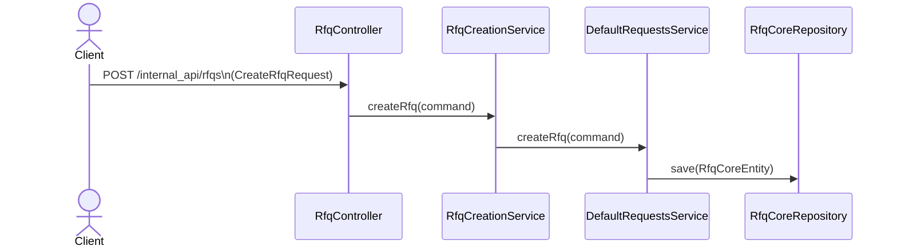
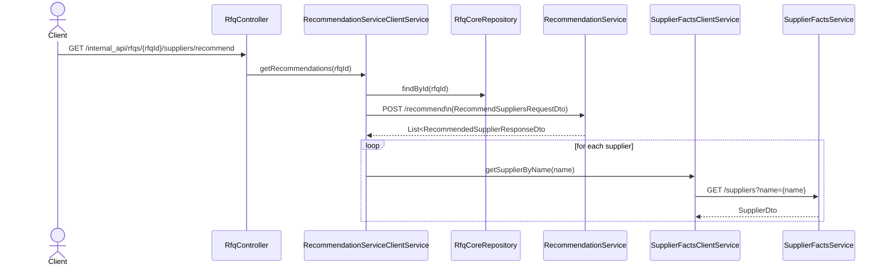
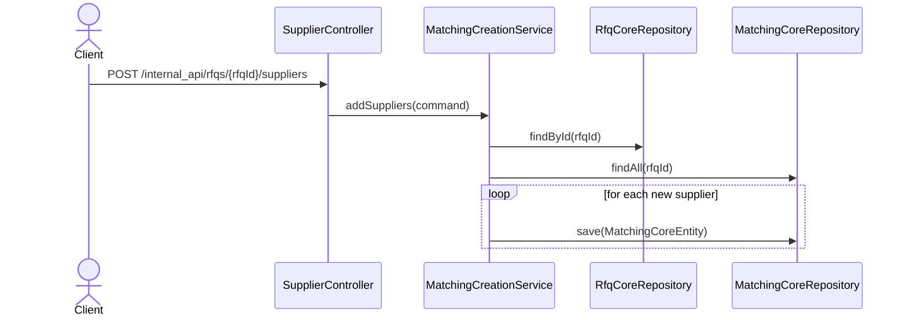
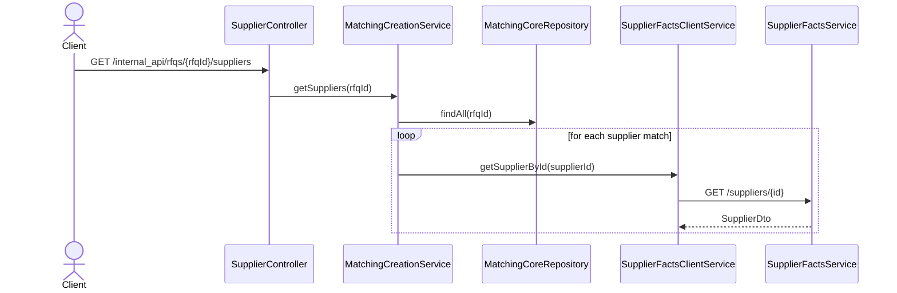

# RFQ Service

The RFQ Service (Request For Quotation) is a backend application responsible for managing RFQs and matching them with
suppliers based on recommendation and supplier facts. It is designed as a lightweight MVP to provide an initial adea
about a direction of further development.

## Swagger API

API is available at: http://localhost:8081/rfq-service/internal_api/swagger-ui/index.html

### Available API Endpoints

1. `POST /internal_api/rfqs` creates RFQ

Request:

```json
{
  "title": "Buy Screws",
  "description": "Looking for suppliers of steel screws",
  "delivery_location": "Berlin",
  "product_type": "Steel Hardware"
}
```

2. `GET /internal_api/rfqs` lists all created RFQs

Response:

```json
[
  {
    "rfqId": "uuid",
    "title": "Buy Screws",
    "description": "Looking for suppliers of steel screws",
    "deliveryLocation": "Berlin",
    "createdAt": "2025-06-15T12:00:00Z",
    "type": "Steel Hardware"
  }
]
```

3. `GET /internal_api/rfqs/{id}` returns RFQ by ID (UUID)

4. `POST /internal_api/rfqs/{rfqId}/suppliers` adds supplier to RFQ

Request:

```json
{
  "suppliers": [
    "uuid1",
    "uuid2"
  ]
}
```

5. `GET /internal_api/rfqs/{rfqId}/suppliers` lists suppliers matched with RFQ

Response:

```json
[
  {
    "id": "matchingId",
    "name": "Acme Corp",
    "created": "2025-06-15T12:00:00Z"
  }
]
```

6. `GET /internal_api/rfqs/{rfqId}/suppliers/recommend` finds supplier recommendations for an RFQ

Response:

```json
[
  {
    "supplier_name": "Acme Corp",
    "supplier_product_name": "Steel Screws",
    "supplier_product_description": "High durability screws",
    "supplier_product_type": "Steel Hardware",
    "supplier_delivery_area": [
      "Berlin",
      "Munich"
    ],
    "score": "0.92",
    "supplier_id": "uuid"
  }
]
```

## Flows

### RFQ Creation Flow



### Supplier Recommendation Flow



### Add Suppliers Flow



### List Matched Suppliers



## Design Choices & Constraints

1. Security is not included: MVP stage, only local dev, not production-ready
2. Cloud Deployment is not supported: MVP stage
3. Test Coverage: lack of unit/integration tests because of not having enough time
4. None of CI/CD: not relevant at the current stage
5. Error handling is minimal as well (No Controller Advice for Exception Handling)
6. No validations of requests on input

## Tech Stack

- Kotlin 2.0
- Spring Boot 3.4.3
- Spring Data JDBC + PostgreSQL
- Flyway for migrations
- Springdoc OpenAPI (Swagger UI)
- Gradle (Kotlin DSL)
- Docker-compose
